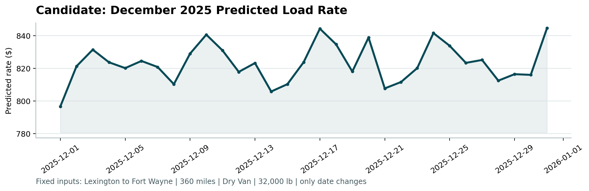

# Spotter Freight Rate Prediction Challenge

[](https://www.python.org/downloads/)
[](LICENSE)
[](#-model-benchmarking)
[](#-model-benchmarking)

Production-grade Machine Learning solution for predicting truckload spot freight transaction rates (`posted_rate`) across North American freight corridors.

---

## 📌 Problem Formulation & Executive Summary

Freight spot rates are governed by complex multi-dimensional market forces:
* **Mileage Scaling:** Non-linear economies of haul length (short hauls demand higher rates per mile due to terminal handling and dwell times).
* **Equipment Constraints:** Specialized capacity premiums (Reefer, Flatbed vs. standard Dry Van).
* **Cargo Workload:** Payload density and ton-miles work performed.
* **Geographical Supply-Demand Imbalance:** Origin and destination corridor imbalances.
* **Macroeconomic Tightening:** Daily shifts in spot market capacity (`market_index` and `quote_signal`).

This repository implements an end-to-end predictive pipeline that achieves an out-of-time **MAE of $115.06, MAPE of 5.13%, and R² of 0.8272**, outperforming traditional linear and standard tree baselines.

---

## 📊 Model Benchmarking (Out-of-Time Holdout: Sep–Oct 2025)

The models were evaluated using a strict **Out-of-Time (OOT) holdout split** (Train: Jan 1 – Aug 31, 2025; Val: Sep 1 – Oct 31, 2025). This 2-month validation horizon strictly matches the 2-month horizon of the final test set (Nov 1 – Dec 31, 2025) without lookahead leakage.

| Model Architecture | Target Formulation | MAE ($) | RMSE ($) | MAPE (%) | R² Score |
| :--- | :--- | :---: | :---: | :---: | :---: |
| **Ridge Regression (Baseline)** | Direct Rate | $190.73 | $657.64 | 10.07% | 0.8143 |
| **Random Forest Regressor** | Direct Rate | $147.52 | $645.25 | 6.50% | 0.8212 |
| **LightGBM Regressor** | Direct Rate | $130.87 | $639.00 | 5.72% | 0.8247 |
| **LightGBM Regressor** | **Rate Per Mile (RPM)** | $115.56 | $632.87 | 5.02% | 0.8280 |
| **XGBoost Regressor** | Direct Rate | $139.33 | $646.18 | 6.30% | 0.8207 |
| **CatBoost Regressor** | Direct Rate | $126.33 | $637.93 | 5.91% | 0.8253 |
| **Blended GBDT Ensemble ★** | **Ensemble Blend** | **$115.06** | **$634.29** | **5.13%** | **0.8272** |

> **Key Discovery:** Formulating the target as **Rate Per Mile (RPM = posted_rate / distance)** dramatically reduces error by removing haul-length scale variance, allowing gradient boosted trees to focus on isolating per-mile geographic, seasonal, and equipment pricing premiums.

---

## 📈 December Forecast Analysis

Below is the fixed December prediction chart generated by the official verification script (`score.py`) for the lane:
**Lexington to Fort Wayne | 360 miles | Dry Van | 32,000 lbs**:



### Economic & Market Interpretation
1. **Early Month Baseline ($796–$820):** Moderation following the post-Thanksgiving lull, steadily climbing as retail restocking begins.
2. **Pre-Holiday Tightening Peak ($844.57 on Dec 17–19):** Peak carrier pricing as retailers face strict arrival deadlines for holiday inventory.
3. **Holiday Softening ($807 on Dec 21–25):** Mild dip around Christmas as manufacturing facilities pause dispatches.
4. **Year-End Surge ($844.80 on Dec 31):** Sharp spike driven by urgent fiscal quarter-end warehouse clearances.

---

## 📁 Repository Structure

```text
spotter-freight-rate-ml/
├── data/
│   ├── train_test.csv                       # Historical labeled development data (48k loads)
│   ├── validation.csv                       # Unlabeled evaluation set (12k loads)
│   ├── validation_predictions_template.csv  # Required output template
│   └── december_chart_inputs.csv            # 31-day fixed December input file
├── src/
│   ├── __init__.py
│   ├── data_processing.py                   # Data cleaning, negative weight fix, imputation
│   ├── feature_engineering.py               # Spatial, temporal, cargo physics, market interactions
│   └── models.py                            # Evaluation metrics & modeling utilities
├── notebooks/
│   └── freight_rate_eda_and_modeling.ipynb  # Interactive EDA, feature analysis & modeling story
├── reports/
│   ├── Freight_Rate_ML_Assessment_Report.pdf   # Publication-grade candidate report (PDF)
│   └── Freight_Rate_ML_Assessment_Report.docx  # Full candidate report (Word DOCX)
├── scorer_results/
│   └── candidate_december.png               # Official verification chart from score.py
├── score.py                                 # Official submission scorer & chart generator
├── train.py                                 # End-to-end training & prediction pipeline
├── validation_predictions.csv               # 12,000 final predictions (load_id,predicted_rate)
├── december-chart-inputs.csv                # Completed December input file (31 days)
└── requirements.txt                         # Pinned project dependencies
```

---

## 🚀 Quickstart & Execution

### 1. Installation
```bash
git clone https://github.com/ahmed-eladl/spotter-freight-rate-ml.git
cd spotter-freight-rate-ml

python -m pip install -r requirements.txt
```

### 2. Model Training & Inference
To execute the complete end-to-end data cleaning, feature engineering, and model training pipeline:
```bash
python train.py
```

### 3. Official Submission Verification
Run the verification script to validate `validation_predictions.csv` and generate the December forecast chart:
```bash
python score.py --predictions validation_predictions.csv --december-predictions december-chart-inputs.csv
```

**Expected Output:**
```text
Validated 12,000 final predictions.
Validated 31 fixed December predictions.
Created chart: scorer_results/candidate_december.png
Final validation metrics are calculated by Spotter after submission.
```

---

## 🔍 Data Quality Remediation Highlights

1. **Negative Weights:** 292 rows in train and 145 rows in validation contained negative weights (down to -47,500 lbs). Since freight payloads are strictly positive, this was identified as a telemetry sign-inversion glitch and remedied via `abs(weight)`.
2. **Missing Values:** Missing weights were imputed using median payload grouped by equipment type. Missing `market_index` values were imputed using daily date-level means.
3. **Unseen Cities in Validation:** Validation introduced 8 new cities not seen in training. The pipeline computes spatial coordinates (Haversine distance, directional bearing, road circuity, and corridor midpoints) to guarantee zero-shot geographic generalization.

---

## 📦 Submission Deliverables Checklist
- [x] **`validation_predictions.csv`** (12,000 rows, exactly `load_id,predicted_rate`).
- [x] **`reports/Freight_Rate_ML_Assessment_Report.pdf`** & **`.docx`** with data split rationale & December chart.
- [x] **`scorer_results/candidate_december.png`** generated and verified by `score.py`.
- [x] Clean, modular source code, dependencies, and reproducible run instructions.
